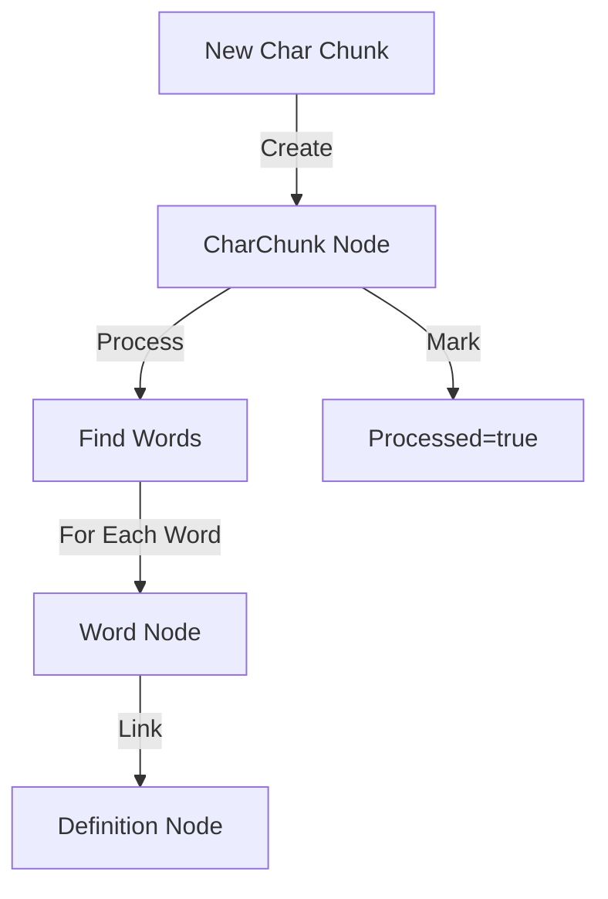
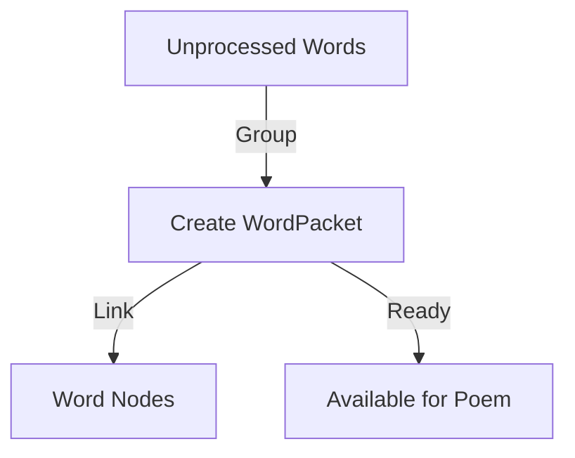
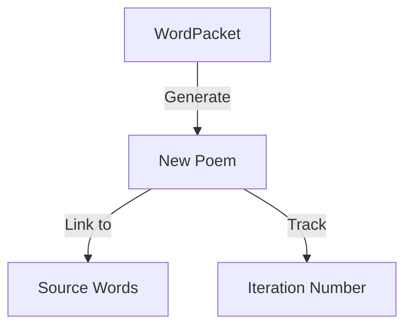

# Neo4j Schema & Data Flow

## Node Types

### 1. CharChunk
```cypher
(CharChunk {
  id: string,          // UUID
  content: string,     // The raw character chunk
  position: number,    // Position in the sequence
  timestamp: DateTime, // When it was generated
  processed: boolean   // Whether it's been processed for words
})
```

### 2. Word
```cypher
(Word {
  value: string,       // The word itself
  position: number,    // Position within chunk
  length: number,      // Word length
  foundAt: DateTime    // When it was discovered
})
```

### 3. Definition
```cypher
(Definition {
  text: string,        // The definition text
  partOfSpeech: string,// Noun, verb, etc.
  source: string       // Dictionary source
})
```

### 4. WordPacket
```cypher
(WordPacket {
  id: string,          // UUID
  sequence: number,    // Order in processing
  wordCount: number,   // Number of words in the packet
  timestamp: DateTime, // When it was created
  processed: boolean   // Whether it's been used in a poem
})
```

### 5. Poem
```cypher
(Poem {
  id: string,          // UUID
  content: string,     // The poem text
  timestamp: DateTime, // When it was generated
  style: string,      // Poetry style used
  iteration: number   // Which cycle of the process
})
```

## Relationships

```cypher
// Word Origins
(CharChunk)-[:CONTAINS_WORD]->(Word)
(Word)-[:APPEARS_IN]->(CharChunk)
(Word)-[:HAS_DEFINITION]->(Definition)

// Word Grouping
(WordPacket)-[:INCLUDES]->(Word)
(Word)-[:PART_OF]->(WordPacket)

// Poem Creation
(Poem)-[:USES_WORD]->(Word)
(Word)-[:APPEARS_IN_POEM]->(Poem)
(WordPacket)-[:GENERATED]->(Poem)
(Poem)-[:DERIVED_FROM]->(WordPacket)
```

## Data Flow

1. **Character Chunk Processing**:


2. **Word Packet Creation**:


3. **Poem Generation**:


## Lifecycle Management

### Reset Process
```typescript
async function resetProcess() {
  // 1. Archive current iteration
  await archiveIteration(currentIteration);
  
  // 2. Clear working data
  await Promise.all([
    deleteProcessedChunks(),
    deleteWordPackets(),
    deleteUnusedWords(),
    clearTrieCache()
  ]);
  
  // 3. Start new iteration
  currentIteration++;
  await initializeNewIteration();
}
```

### Archiving
- Keep minimal metadata about previous iterations
- Store summary statistics
- Maintain selected poems
- Clear working data

## Query Examples

1. **Trace Word Origins**:
```cypher
MATCH (p:Poem)-[:USES_WORD]->(w:Word)-[:APPEARS_IN]->(c:CharChunk)
WHERE p.id = $poemId
RETURN w.value, c.content, w.position
```

2. **Find Unused Words**:
```cypher
MATCH (w:Word)
WHERE NOT (w)-[:APPEARS_IN_POEM]->(:Poem)
RETURN w.value
```

3. **Get Word Journey**:
```cypher
MATCH path = (c:CharChunk)-[:CONTAINS_WORD]->(w:Word)-[:PART_OF]->(wp:WordPacket)-[:GENERATED]->(p:Poem)
WHERE w.value = $word
RETURN path
```

## Implementation Strategy

### Phase 1: Basic Structure
1. ✅ Set up Neo4j connection
2. ⬜ Create base node types
3. ⬜ Implement basic CRUD operations
4. ⬜ Add relationship creation

### Phase 2: Processing Flow
1. ⬜ Chunk ingestion
2. ⬜ Word discovery
3. ⬜ Packet creation
4. ⬜ Poem generation

### Phase 3: Lifecycle Management
1. ⬜ Iteration tracking
2. ⬜ Reset process
3. ⬜ Archiving
4. ⬜ Cleanup

## Questions to Consider

1. How to handle word frequency across iterations?
2. Should we store failed word matches?
3. How to track processing performance?
4. What metadata to keep after reset?
5. How to handle transaction boundaries?

## Next Steps

1. Create Neo4j service class
2. Set up connection pooling
3. Implement base operations
4. Create test dataset
5. Build reset functionality 